---

## 🧑‍🤝‍🧑 Persona Matrix

Below is a quick matrix mapping **personae → goals → documentation needs → example repos**.

### Matrix (Table)
| Persona | Primary Goals | Documentation Needs | Example Repos |
|---|---|---|---|
| Developers / Integrators | Integrate APIs quickly & safely | Setup, auth, endpoints, examples, error cases | node-movie-api • social-media-back-end • video-sharing-api |
| C++ Library Users | Use DB lib in C++ projects | Build steps, API surface, usage patterns, error handling | cpp-mongoose |
| CS Students / Researchers | Understand algorithms & complexity | Concept overview, visuals, proofs/intuition, example I/O | Aho–Corasick-Algorithm • Enigma-cpp |
| End-users / Hobbyists | Run demos & small CLIs | One-line run, screenshots/GIFs, flags/options, expected output | terminal-fire-animation • cli-slot-game |

### Matrix (Diagram)

```mermaid
flowchart TB
  subgraph Personas
    Dev[Developers]
    Cpp[C++ Library Users]
    CS[CS Students/Researchers]
    End[End-users/Hobbyists]
  end

  subgraph Doc_Types
    API[API Docs]
    LIB[Library/System Docs]
    ALG[Algorithm/Concept Docs]
    USR[User/Demo Docs]
  end

  subgraph Repos
    Movie[node-movie-api]
    Social[social-media-back-end]
    Video[video-sharing-api]
    CppLib[cpp-mongoose]
    Aho[Aho–Corasick]
    Enigma[Enigma-cpp]
    Fire[terminal-fire-animation]
    Slot[cli-slot-game]
  end

  Dev --> API
  Cpp --> LIB
  CS  --> ALG
  End --> USR

  API --> Movie
  API --> Social
  API --> Video

  LIB --> CppLib

  ALG --> Aho
  ALG --> Enigma

  USR --> Fire
  USR --> Slot
```

